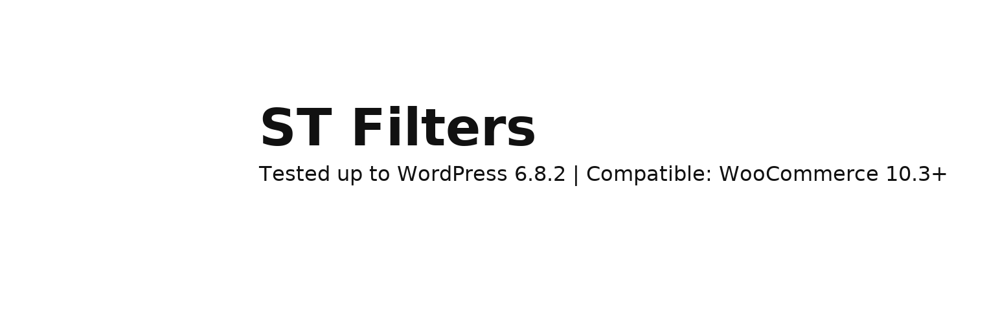

# 🧩 ST Filters

> **Multi-select chip filters and toggle product grid for WooCommerce**  
> Modern AJAX filtering with Elementor integration, category/tag/brand chips, and responsive toggle sidebar.


---

## 🏷️ Plugin Info

| Tested up to | Compatible WooCommerce | Requires PHP | Version |
|-------------|------------------------|--------------|--------|
| **6.8.2** | **10.3+** | **7.4+** | **1.0.0** |

---

## 🚀 Overview

**ST Filters** brings a clean, fast, chip‑based filtering experience to WooCommerce, designed with modern UI principles and performance in mind.

✨ **Key features**
- ✅ **Multi‑select chips** for Categories, Tags, and Brands  
- ⚡ **AJAX product grid** (no page reloads)  
- 🎯 **Elementor widget: _ST Filter_** with full query + styling controls  
- 🔔 **“Notify Me” out‑of‑stock popup support** (Elementor Pro ready)  
- 📱 **Responsive toggle mobile filters**  
- 🧼 **Lightweight architecture** (no bloat, extensible OO codebase)  

---

## 🧩 Shortcode Usage

### Basic
```php
[st_filters]
```

### With filtering scope + settings
```php
[st_filters 
    cat_in="helmets,45" 
    tag_in="summer,clearance" 
    brand_in="arai,7"
    columns="3"
    per_page="12"
    sort="price_asc"
]
```

| Attribute | Description |
|----------|-------------|
| `cat_in` | Include categories (slug or ID comma‑list) |
| `tag_in` | Include tags (slug or ID comma‑list) |
| `brand_in` | Include brands (slug or ID comma‑list) |
| `columns` | Grid columns (default `3`) |
| `per_page` | Products per page (default `9`) |
| `sort` | `default`, `price_asc`, `price_desc`, `in_stock`, `preorder`, `out_of_stock` |

---

## 🧱 Elementor Widget: **ST Filter**

Drag → drop → filter.  

This widget includes:

🛠 **Query Controls**  
- Include/exclude category, tag, brand terms  
- Pagination control  
- Sort control  

🎨 **Style Controls**  
- Card background  
- Typography  
- Chip design and spacing  
- Grid layout controls  



---

## 📁 File Structure

```
st-filters/
│
├── st-filters.php                # Bootstrap / loader
├── includes/
│   ├── class-st-filters.php
│   ├── class-st-shortcode.php
│   ├── class-st-ajax.php
│   ├── class-st-elementor-widget.php
│   └── helpers.php
│
├── templates/
│   └── content-product-st.php
│
└── assets/
    ├── css/st-filters.css
    ├── js/st-filters.js
    ├── st-filters-icon.png
    ├── st-filters-banner-light.png
    ├── st-filters-banner-dark.png
    └── st-filters-badge-header.png
```

---

## 🔔 Stock Notification Integration

If a product is **out of stock**, ST Filters can trigger your Elementor popup:

```js
elementorProFrontend.modules.popup.showPopup({ id: YOUR_POPUP_ID });
```

Hidden form fields populate automatically for product title & ID.

---

## 🧠 Architecture Notes

- Follows **OOP modular WordPress plugin structure**
- Uses **WordPress AJAX API + WooCommerce product loop**
- Template override support via:
  ```
  yourtheme/woocommerce/content-product-st.php
  ```

---

## 🖼 Screenshots
(Screenshots pending — auto‑generate when live in repo)

1. Chip filter UI  
2. AJAX product grid  
3. Elementor widget — Query tab  
4. Elementor widget — Style tab  
5. Stock “Notify Me” popup  

---

## 🧾 Changelog

### 1.0.0
- Initial stable release  
- Elementor widget included  
- AJAX filtering architecture  
- Brand & Tag chips support  
- Stock notification system  

---

## 💡 License

Licensed under **GPL‑2.0 or later**  
https://www.gnu.org/licenses/gpl-2.0.html

---

## ✨ Credits

Built with ❤️ by **Syed Zeeshan Ali**  
_“Modern, fast WooCommerce enhancements for 2025+ stores.”_

---
